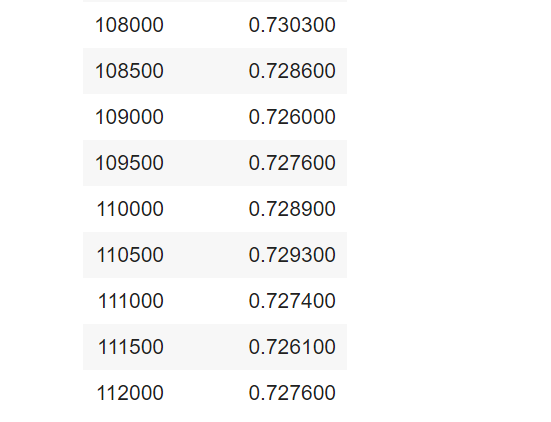

# Internship AI Engineer Training Program

#### Duration: 8/3/2021 - 14/3/2021

#### Task:

1. Setup env.
2. Preprocessing MIMIC-III dataset. Click [here](https://www.kaggle.com/ssikmr/mimiciii) to download raw data and click [here](https://drive.google.com/file/d/1yQj6iiAQPvl9ar83Fa1fhcNSHJQz-6QV/view?usp=sharing) to download clean data.
3. Pre-training Tiny-BERT on PubMed and MIMIC-III with initial weights BERT (pretrained on Wikipedia and Bookcorpus). Model is trained [here](https://drive.google.com/drive/folders/1ZClRxCT2mMjpwPV3cQZQdt-Ha0p0M2NV?usp=sharing).

#### Result:

[Link](https://drive.google.com/drive/folders/1xBaKU7ZnWIHAx0Ji75cV6VqAvd_qA7NH?usp=sharing) checkpoint model, that is trained on MIMIC-III chest x ray data.