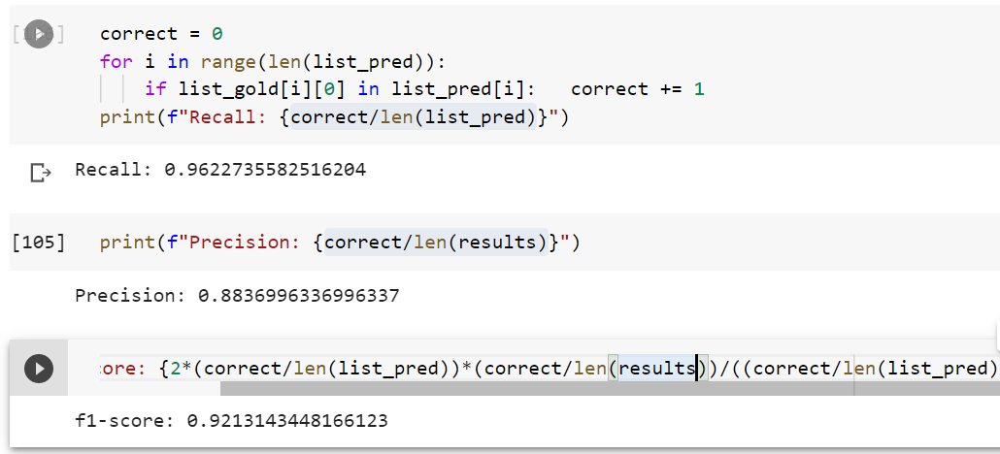

##### Source code is implemented from [paper](https://arxiv.org/pdf/2103.00488.pdf)
BERT-based Acronym Disambiguation with Multiple Training Strategies

##### Data we are download from challenge Acronym Disambiguation in `Shared Task` `SDU@AAA-21`. You can go [here](https://sites.google.com/view/sdu-aaai21/shared-task) to get more information.

### Usage

- Preprocessing data: `python preprocessing.py`

- Create negative data: `python create_negative_sample.py`

- Trainning model `python train.py`

- Evaluate model `python evaluate.py`

- Inference model `python inference.py`

##### Results of model in dev set

##### Results of paper

